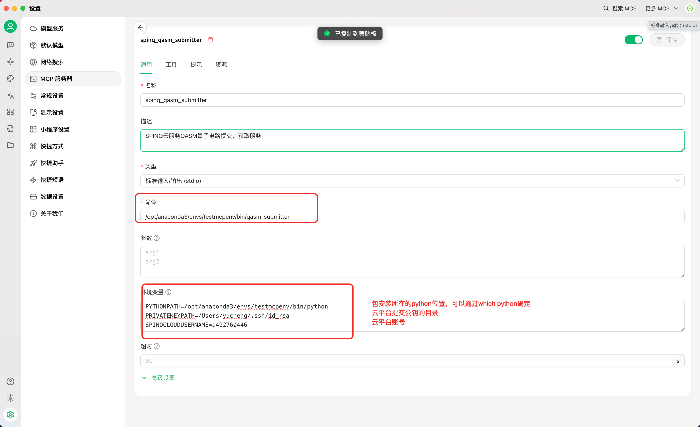
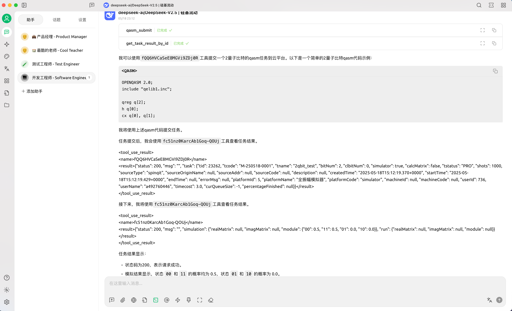
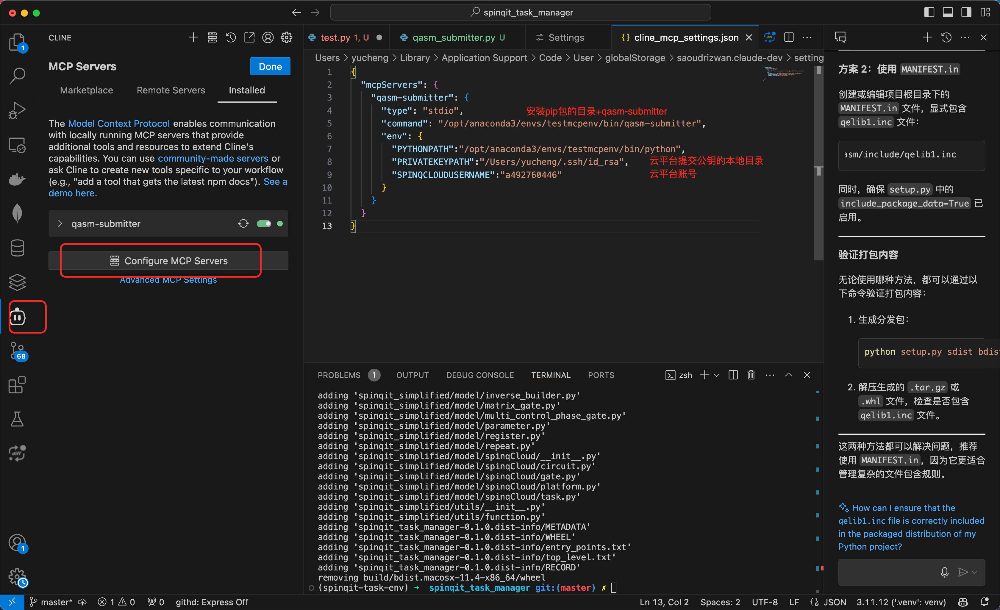
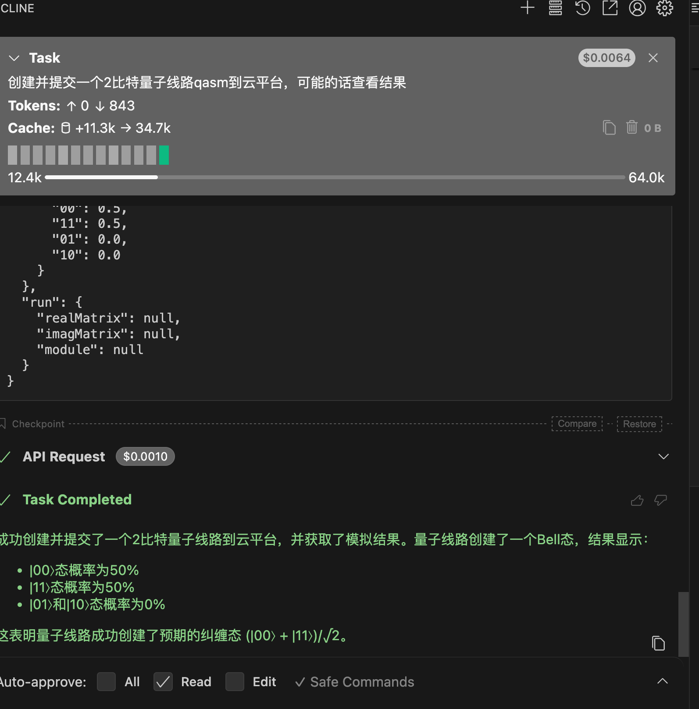
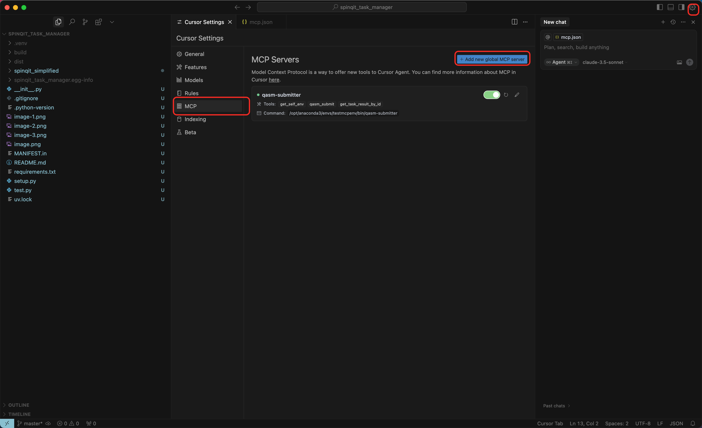
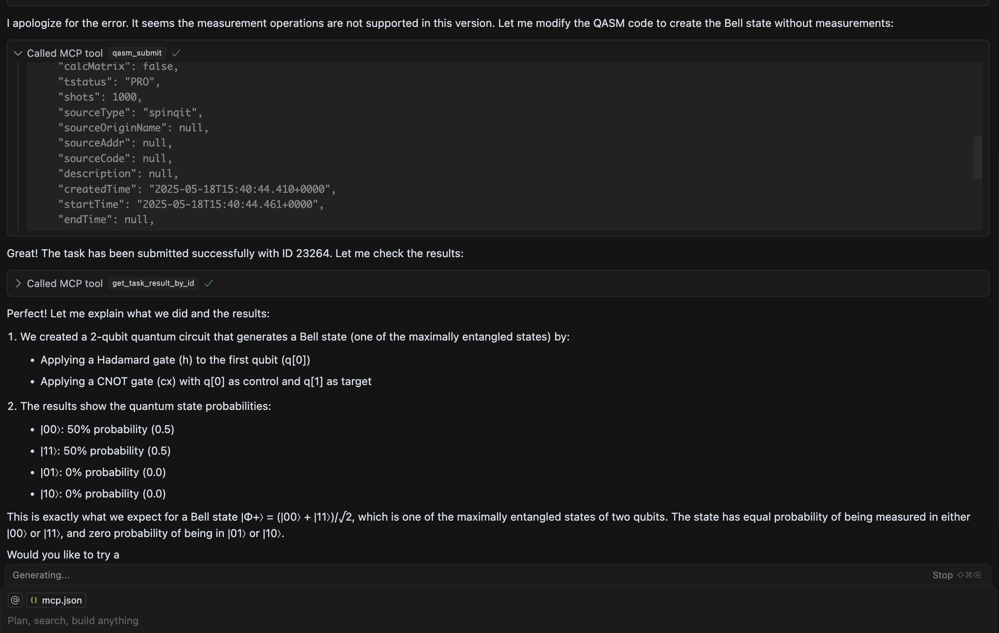

### 工作流程
- 整理调用的逻辑，确认这个工具的可插拔性，可自适应找环境变量，找不到时要求配置 ✅
- 发布  ✅
- 测试不同工具的可行性  ✅ cursor vscode cherry-studio 
- 主要处理了： 1. 针对大模型默认measure进行限制报错，2. 针对大模型对qasm特殊符号总是可能做多次转义进行限制，3. 补充了根据id读取task result的功能
### 安装
- 依赖python 3.10以上
- pip install spinqit_task_manager
- 对应python目录环境变量下会将脚本qasm-submitter 映射到 spinqit_simplified.qasm_submitter:run_server函数中

### 使用
- 环境简单的话，直接执行qasm-submitter
- 环境复杂就看python安装在哪个目录如：
  - 我的conda在/opt/anaconda3/envs/testmcpenv/bin/python
  - 于是可以直接执行/opt/anaconda3/envs/testmcpenv/bin/qasm-submitter

### 环境测试情况 （创建并提交一个2比特量子线路qasm到云平台，可能的话查看结果）
- mac python 3.10.16 cherry-studio
  - 配置项：
    - 命令： /opt/anaconda3/envs/testmcpenv/bin/qasm-submitter
    - 环境变量：
      - PYTHONPATH=/opt/anaconda3/envs/testmcpenv/bin/python
      - PRIVATEKEYPATH=/Users/yucheng/.ssh/id_rsa
      - SPINQCLOUDUSERNAME=a492760446
    - 
  - 结果
    - 

- vscode cline插件
  - 配置项：
    ```
    {
      "mcpServers": {
        "qasm-submitter": {
          "type": "stdio",
          "command": "/opt/anaconda3/envs/testmcpenv/bin/qasm-submitter",
          "env": {
            "PYTHONPATH":"/opt/anaconda3/envs/testmcpenv/bin/python",
            "PRIVATEKEYPATH":"/Users/yucheng/.ssh/id_rsa",
            "SPINQCLOUDUSERNAME":"a492760446"
          }
        }
      }
    }
    ```
  - 配置方式
    - 
  - 结果
    - 

- cursor
  - 配置项
    ```
    {
      "mcpServers": {
        "qasm-submitter": {
          "type": "stdio",
          "command": "/opt/anaconda3/envs/testmcpenv/bin/qasm-submitter",
          "env": {
            "PYTHONPATH":"/opt/anaconda3/envs/testmcpenv/bin/python",
            "PRIVATEKEYPATH":"/Users/yucheng/.ssh/id_rsa",
            "SPINQCLOUDUSERNAME":"a492760446"
          }
        }
      }
    }
    ```
  - 配置方式
    - 
  - 结果
    - 