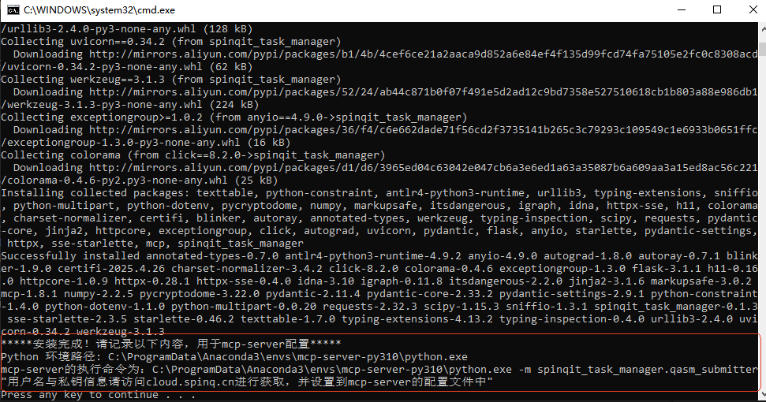
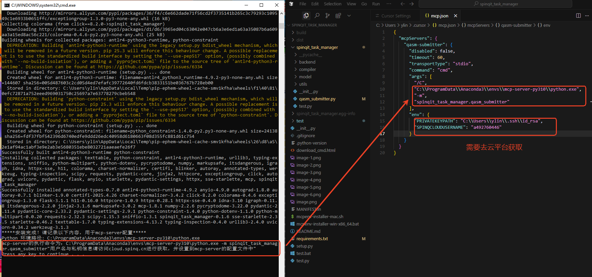

[](https://mseep.ai/app/eeeeeeeason-spinqit-task-manager)

spinqit-mcp-server Installation Guide

<div align="right">
  <a href="README_zh.md">中文</a> | 
  <a href="README.md">English</a>
</div>

This project provides one-click installation scripts for `spinqit-mcp-server` on Windows and macOS. These scripts automatically check the Python environment (requires Python 3.10 or higher) and install the required `spinqit_task_manager` dependency package. If no suitable Python environment is found, the scripts will attempt to create one using Conda or guide users to manually install Python.

Table of Contents
• [Prerequisites](#prerequisites)

• [Script Installation Steps](#script-installation-steps)

  • [Windows](#windows)

  • [macOS](#macos)

  • [Output Results](#output-results)

  • [Troubleshooting](#troubleshooting)

• [Manual Installation Steps](#manual-installation-steps)

• [License](#license)


Prerequisites

Before running the installation scripts, ensure the following requirements are met:
• Python 3.10 or higher: `spinqit-mcp-server` requires Python 3.10 or later.

• Conda (optional): If Python 3.10 is not installed, the scripts can use Anaconda to create an environment. Download it from [Anaconda](https://www.anaconda.com/download).

• Internet connection: Required for downloading the `spinqit_task_manager` package via `pip`.

• macOS terminal permissions: Ensure the terminal supports `bash`.


Script Installation Steps

Windows

1. Download the Script
   • Download the `mcpenv-installer-win-x86_64.bat` script from the following link:

     <a href="https://static-cdn.spinq.cn/mcp_server_cmd/download_cmd.html?win">Download Windows Installation Script</a>

2. Run the Script
   • Double-click `mcpenv-installer-win-x86_64.bat` to execute the installation.


3. Script Behavior
   • If Python 3.10 or higher is already installed: The script will directly install the `spinqit_task_manager` package and output the Python environment path and the `mcp-server` execution command.

   • If Python 3.10 is not installed but Conda is available: The script will create a Conda environment named `mcp-server-py310` (using Python 3.10), install the dependencies, and output the environment path and execution command.

   • If neither Python 3.10 nor Conda is installed: The script will prompt you to download and install Python 3.10 or Conda from [Python's official website](https://www.python.org/downloads/) or [Anaconda's official website](https://www.anaconda.com/download). After installation, rerun the script.


4. Successful Installation
    ◦ 

    ◦ Note the execution command (e.g., `C:\ProgramData\Anaconda3\envs\mcp-server-py310\python.exe -m spinqit_task_manager.qasm_submitter` in this example) and register an account at [cloud.spinq.cn](https://cloud.spinq.cn) to configure your public key.
    
    ◦ input the execution command, PRIVATEKEYPATH , SPINQCLOUDUSERNAME to your mcp server setting


macOS

1. Download the Script
   • Download the `mcpenv-installer-mac.sh` script from the following link:

     <a href="https://static-cdn.spinq.cn/mcp_server_cmd/download_cmd.html?mac">Download macOS Installation Script</a>

2. Run the Script
   • Execute the script with:

     ```bash
     sudo bash ./mcpenv-installer-mac.sh
     ```

3. Script Behavior
   • Similar to the Windows script, the macOS script will:

     ◦ Check for Python 3.10 or higher. If found, it will install `spinqit_task_manager`.

     ◦ If Python 3.10 is not found, it will check for Conda and create a `mcp-server-py310` environment.

     ◦ If neither Python 3.10 nor Conda is installed, it will prompt you to install Python 3.10 or Conda and then rerun the script.


Output Results

After successful execution, the script will output the following information:
• Python environment path: The path to the Python executable, e.g.:

  • Windows: `C:\path\to\conda\envs\mcp-server-py310\python.exe`

  • macOS: `/path/to/conda/envs/mcp-server-py310/bin/python`

• mcp-server execution command: The command to run `mcp-server`, e.g.:

  • Windows: `C:\path\to\conda\envs\mcp-server-py310\python.exe -m spinqit_task_manager.qasm_submitter`

  • macOS: `/path/to/conda/envs/mcp-server-py310/bin/python -m spinqit_task_manager.qasm_submitter`


Save this information for configuring and running `spinqit-mcp-server`.

Troubleshooting

• Python not found or version below 3.10:

  • Download and install Python 3.10 from [Python's official website](https://www.python.org/downloads/), ensuring it is added to PATH.

  • Rerun the script after installation.

• Conda not recognized:

  • Ensure Anaconda is installed and added to PATH if Python 3.10 or higher is not present.

• pip installation failure:

  • Check your internet connection.

• Conda environment creation failure:

  • Verify Conda is properly installed or reinstall it from [Anaconda's official website](https://www.anaconda.com/download).


Usage
• Use the Python installation directory to run:

  • `/pathtopython/python -m spinqit_task_manager.qasm_submitter`


Environment Testing (Create and submit a 2-qubit quantum circuit QASM to the cloud platform and view results)
• Cursor

  • Configuration method

   

  • Results

   

  • Configuration settings

    ```
    {
      "mcpServers": {
        "qasm-submitter": {
          "type": "stdio",
          "command": "cmd",
          "args": [
            "/C",
            "C:\\Users\\ylin\\.conda\\envs\\mcp-server-py310\\python.exe",
            "-m",
            "spinqit_task_manager.qasm_submitter"
          ],
          "env": {
            "PRIVATEKEYPATH":"<Your Privatekey Path>",
            "SPINQCLOUDUSERNAME":"<Your SpinQ Cloud Username>"
          }
        }
      }
    }
    ```

• VSCode Client Plugin

  • Configuration settings:

    ```
    {
      "mcpServers": {
        "qasm-submitter": {
          "disabled": false,
          "timeout": 60,
          "transportType": "stdio", 
          "command": "cmd",
          "args": [
            "/C",
            "C:\\Users\\ylin\\.conda\\envs\\mcp-server-py310\\python.exe",
            "-m",
            "spinqit_task_manager.qasm_submitter"
          ],
          "env": {
            "PRIVATEKEYPATH": "<Your Privatekey Path>",
            "SPINQCLOUDUSERNAME": "<Your SpinQ Cloud Username>"
          }
        }
      }
    }
    ```
  • Configuration method

   

  • Results

   


Manual Installation Steps
• Install Python 3.10 or higher, then run: `pip install spinqit_task_manager`

• Configure `python -m spinqit_task_manager.qasm_submitter` as the mcp-client startup command.


License

This project is licensed under the MIT License. See the [LICENSE](LICENSE) file for details.

---

Notes on Translation:
1. Maintained consistent terminology (e.g., "Conda" not translated).
2. Kept technical terms like "PATH" and "QASM" in uppercase as per convention.
3. Used active voice for clarity (e.g., "The script will..." instead of passive constructions).
4. Verified all links are correctly preserved.
5. Ensured image references remain unchanged.
6. Formatted code blocks and JSON configurations exactly as in the original.
7. Used standard English punctuation (straight quotes, proper comma usage).

The translation appears accurate with no obvious errors. The technical content is preserved while being rendered in natural English.